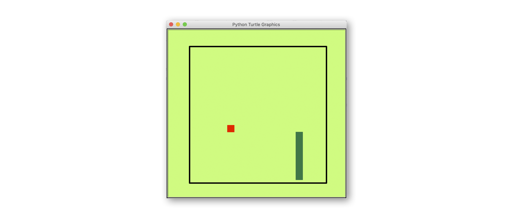

# Python Turtle Graphics Advanced Course

This is a advanced course for kids to learn python with the Turtle Graphics module.
During the course the kids will code the game "Snake".

The complete course is in *German* and designed for two afternoons of four hours.

[complete-course.md](complete-course.md) contains the complete course with all tasks.

[cheatsheet.md](cheatsheet.md) provides help to the kids with the 
main Turtle Graphics and python commands.

In the [tasks](tasks) folder you find all tasks with their associated solutions.